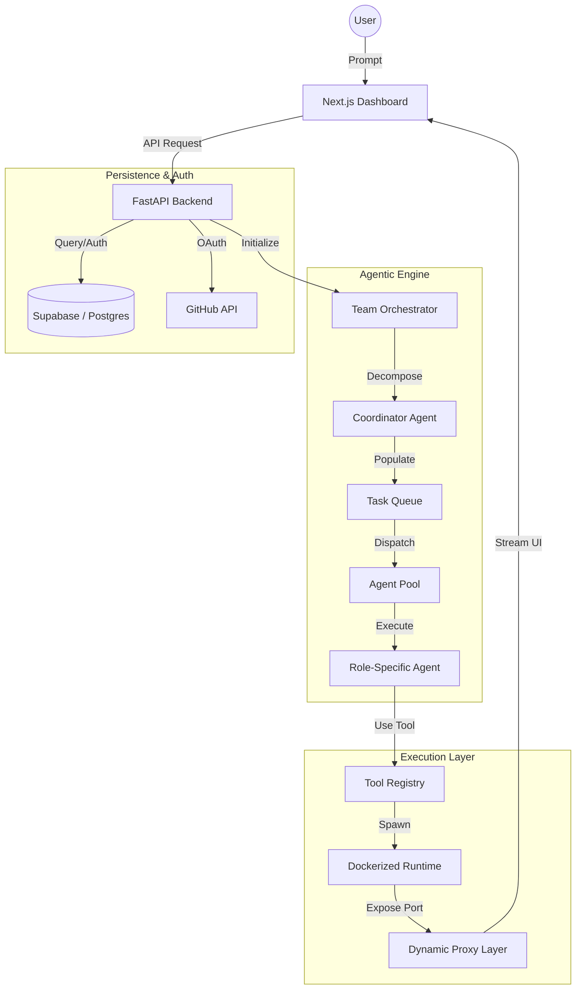

# Technical Documentation — Multi-Agent Platform (V0.3.0)

## Table of Contents
1. [Vision & System Overview](#1-vision--system-overview)
2. [Core Architecture](#2-core-architecture)
3. [The Agentic Engine](#3-the-agentic-engine)
4. [Team Orchestration System](#4-team-orchestration-system)
5. [Dockerized Execution Pipeline](#5-dockerized-execution-pipeline)
6. [Dynamic Proxy & Asset Routing](#6-dynamic-proxy--asset-routing)
7. [Security & Authentication](#7-security--authentication)
8. [Monitoring & Cost Tracking](#8-monitoring--cost-tracking)
9. [Contracts & Validation](#9-contracts--validation)
10. [Real-time Observability (WebSockets)](#10-real-time-observability-websockets)
11. [Backend API Reference](#11-backend-api-reference)
12. [Configuration Reference](#12-configuration-reference)

---

## 1. Vision & System Overview

The Multi-Agent Platform is a **state-of-the-art autonomous software engineering system** designed to transform high-level natural language requirements into functional, deployed applications. Unlike simple LLM wrappers, it employs a **multi-agent hierarchical structure** where specialist agents (Architects, Engineers, Reviewers) collaborate within an isolated execution environment.

### Core Pillars
- **Autonomy**: Hierarchical task decomposition with dependency-aware scheduling.
- **Safety & Isolation**: Code execution is sandboxed using Docker containers.
- **Interoperability**: Unified Pydantic contracts for all inter-agent and system-wide communication.
- **Observability**: Real-time streaming of internal agent thoughts, tool calls, and execution logs.

---

## 2. Core Architecture

The system is built on a decoupled, modular architecture that separates the agentic logic from the execution runtime.

### High-Level Component Graph



---

## 3. The Agentic Engine

### 3.1 BaseAgent Lifecycle
The `BaseAgent` provides a standardized interface for all AI agents, managing the conversation loop and tool-use logic.

```python
async def execute(request: AgentRequest) -> AgentResponse:
    # 1. Prompt Construction: Injects system identity, task, and shared memory.
    messages = build_prompt(request)
    
    # 2. LLM Loop: Handles iterative tool calls (up to 15 turns).
    while response_has_tool_calls:
        results = await tool_executor.execute_batch(tool_calls)
        messages.append(results)
        response = await llm.generate(messages)
    
    # 3. Validation: Parses response against expected schema.
    return finalize_response(response)
```

### 3.2 Tool System & Sandboxing
Tools are defined using Pydantic schemas, allowing LLMs to understand input requirements via JSON Schema.
- **BashTool**: Executes commands in a controlled shell environment.
- **FileRead/WriteTool**: Manipulates files within the workspace.
- **WebSearchTool**: Fetches real-time data for grounding.

---

## 4. Team Orchestration System

### 4.1 Coordinator Pattern
The **Coordinator Agent** acts as the project manager. It receives the high-level goal and the roster of available agents, then generates a **Dependency-Aware Task Graph (DAG)**.

### 4.2 Shared Memory & Message Bus
- **SharedMemory**: A namespaced Key-Value store where agents persist findings (e.g., `architect/db-schema`). This is injected into the context of downstream agents.
- **MessageBus**: Allows asynchronous broadcasting of events (e.g., `TASK_COMPLETED`) across the team.

---

## 5. Dockerized Execution Pipeline

A breakthrough in V0.3.0 is the transition from local subprocess execution to **Dockerized sandboxing**.

### 5.1 Provisioning Flow
When an agent completes an "Implementation" phase, the system:
1.  **Exports Artifacts**: Collects all generated files into a temporary workspace.
2.  **Scaffolding**: Automatically generates `package.json` and `vite.config.ts` if missing.
3.  **Dockerization**:
    - Generates a optimized `Dockerfile` based on `node:20-alpine`.
    - Creates a `docker-compose.yml` with port mapping and environment variables.
4.  **Execution**: Runs `docker-compose up --build` in a background thread.

### 5.2 Container Lifecycle
- **Isolation**: Each pipeline run gets a unique container ID (`agent-workspace-[hash]`).
- **Persistence**: Workspace volumes are mounted to allow agents to modify code in real-time while the server is running (Hot Module Replacement).

---

## 6. Dynamic Proxy & Asset Routing

To allow the frontend to "see" inside the Docker container without exposing multiple ports to the internet, we implemented a **Dynamic Reverse Proxy**.

### 6.1 Path Rewriting Logic
The backend routes requests from `/api/proxy/{port}/*` to `127.0.0.1:{port}`. To support modern frontend frameworks (Vite/React), the proxy performs **on-the-fly response body modification**:

```python
def _rewrite_vite_asset_paths(text: str, port: int) -> str:
    # Rewrites "/src/main.tsx" -> "/api/proxy/3001/src/main.tsx"
    # Inject <base href="/api/proxy/3001/"> into HTML
```

This ensures that all asset loads (JS, CSS, HMR WebSockets) are correctly routed through the authenticated backend tunnel.

---

## 7. Security & Authentication

### 7.1 GitHub OAuth Integration
The platform uses GitHub OAuth for secure developer onboarding.
- **Flow**: Frontend redirects to GitHub -> Backend receives code -> Exchanges for token -> Creates/Updates user in Supabase.
- **Role-Based Access**: Project and pipeline access is scoped to the authenticated user.

### 7.2 API Security
- All sensitive endpoints are protected by Supabase JWT verification.
- The Proxy layer only allows connections to non-system ports (>1024) to prevent internal service probing.

---

## 8. Monitoring & Cost Tracking

The `CostTracker` module provides granular visibility into LLM expenditure.

| Metric | Tracking Mechanism |
|--------|-------------------|
| **Input Tokens** | Tracked per LLM provider call |
| **Output Tokens** | Tracked per LLM provider call |
| **Tool Calls** | Counted as distinct events |
| **USD Cost** | Calculated based on model-specific pricing (GPT-4o, Claude 3.5 Sonnet, etc.) |

---

## 9. Contracts & Validation

Rigid type-safety is maintained across the stack using Pydantic.

- `AgentRequest`: The input "envelope" for any agent task.
- `AgentResponse`: The output "envelope" containing markdown, artifacts, and confidence scores.
- `PipelineEvent`: The schema for all real-time updates sent over WebSockets.

---

## 10. Real-time Observability (WebSockets)

The system uses a unified event bus to stream internal state to the user.

- **Pipeline States**: `STARTED`, `STAGE_RUNNING`, `COMPLETED`, `FAILED`.
- **Agent Logs**: Raw terminal output from Docker containers is streamed directly to the IDE's terminal panel.
- **Agent Thoughts**: Non-deterministic reasoning steps are captured and displayed in a "Thought Process" UI component.

---

## 11. Backend API Reference

| Endpoint | Method | Description |
|----------|--------|-------------|
| `/api/auth/github` | `GET` | Initiates GitHub OAuth flow |
| `/api/pipelines/{id}/run` | `POST` | Triggers Dockerized app execution |
| `/api/pipelines/{id}/logs` | `GET` | Fetches real-time Docker logs |
| `/api/proxy/{port}/{path}` | `ALL` | Proxies traffic to containerized dev servers |

---

## 12. Configuration Reference

Key environment variables in `.env`:

| Variable | Description |
|----------|-------------|
| `GITHUB_CLIENT_ID` | GitHub OAuth Client ID |
| `SUPABASE_URL` | Supabase Project URL |
| `MAX_CRITIC_ITERATIONS` | Number of feedback loops for agent refinement |
| `WORKSPACE_DIR` | Host path for Docker volume mounting |
| `MAX_CONCURRENCY` | Max parallel agent executions |
| `DEBUG` | Enable verbose logging and debug mode |
| `LOG_LEVEL` | Logging verbosity (DEBUG, INFO, ERROR) |
| `CORS_ORIGINS` | List of allowed origins for the API |
