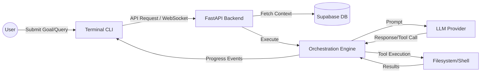
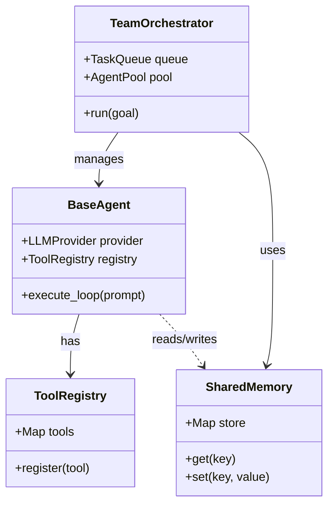
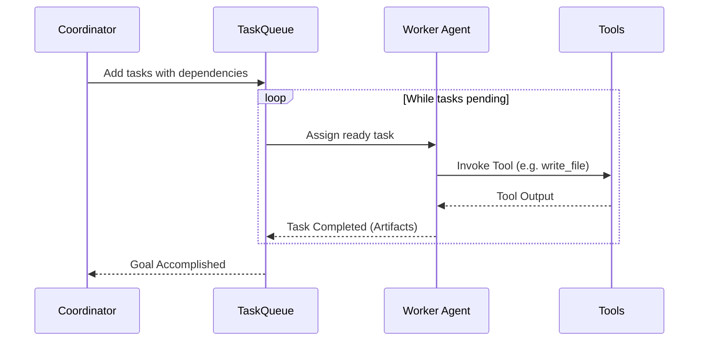

# Chapter 3: Software Design

## 3.1 Data Flow Diagram (DFD) - Level 0

The following diagram illustrates the high-level data flow between the user and the platform components.

## 3.2 UML Diagrams

### Class Diagram (Core Engine)

The relationship between the Orchestrator, Agents, and Tools.

### Sequence Diagram (Task Execution)

## 3.3 Database Design

The database uses PostgreSQL (managed by Supabase) with the following core entities:

### E-R Diagram Summary
- **Projects**: The top-level container for all engineering work.
- **Pipelines**: A single execution run for a project requirement.
- **Stages**: Individual steps in a pipeline (e.g., Design, Code, Review).
- **Artifacts**: Structured data produced by stages (files, logs, metadata).

### Table Definitions

| Table | Fields | Data Type | Key |
| :--- | :--- | :--- | :--- |
| **projects** | id, name, description, owner_id | UUID, String, Text, UUID | PK (id) |
| **pipelines**| id, project_id, requirement, status | UUID, UUID, Text, Enum | PK (id), FK (project_id) |
| **stages** | id, pipeline_id, stage_name, status | UUID, UUID, String, Enum | PK (id), FK (pipeline_id) |
| **artifacts** | id, stage_id, type, data | UUID, UUID, String, JSONB | PK (id), FK (stage_id) |
